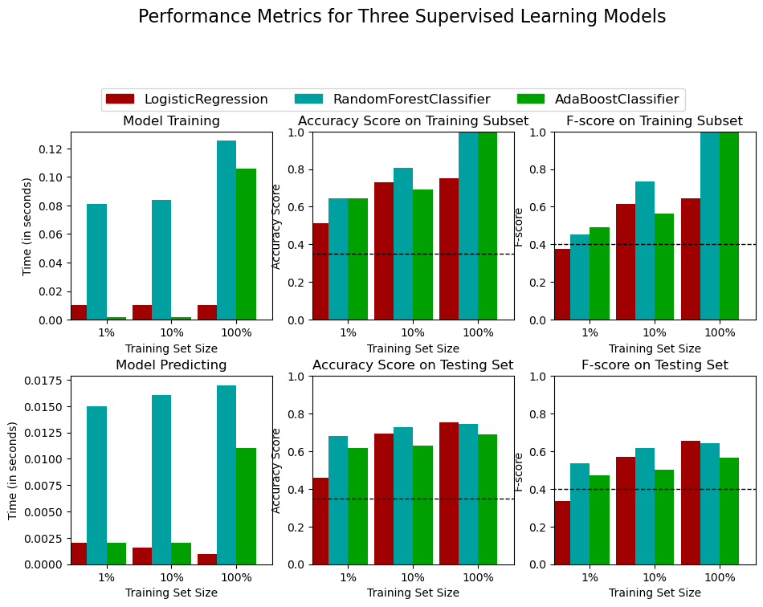
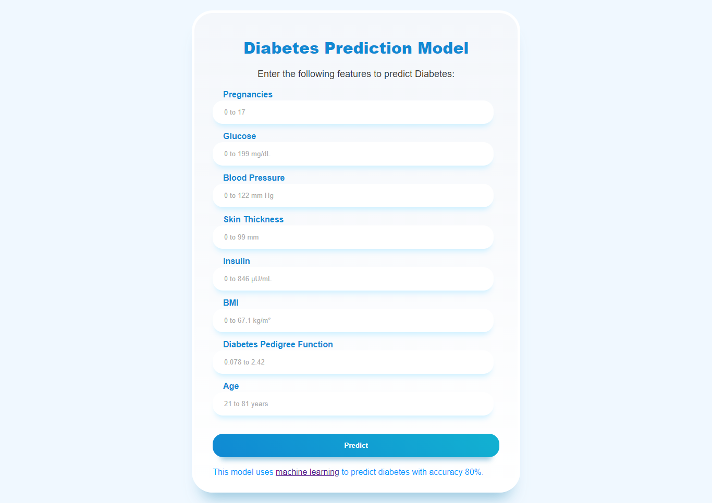

# Diabetes Prediction Project

Diabetes is a chronic disease that affects millions of people worldwide. It is caused by the body's inability to produce or use insulin effectively, resulting in high blood sugar levels. Early detection and timely management of diabetes can prevent complications and improve the quality of life for patients. Machine learning algorithms can be used to predict the risk of developing diabetes.

In this project, we aim to successfully predict whether a person has diabetes or not using logistic regression, decision tree, random forest classifier, and naive Bayes algorithms.

## Feature Set Exploration

1. **Pregnancies:** Number of times the person has been pregnant. Ranges from 0 to 17 pregnancies.
2. **Glucose:** Glucose level in the person's blood, measured in mg/dL. Ranges from 0 to 199 mg/dL.
3. **Blood Pressure:** Blood pressure measurement, consisting of systolic and diastolic blood pressure in mm Hg. Systolic ranges from 0 to 122 mm Hg, while diastolic ranges from 0 to 99 mm Hg.
4. **Skin Thickness:** Thickness of the person's skin in mm, measured using a caliper. Ranges from 0 to 99 mm.
5. **Insulin:** Insulin level in the person's blood, measured in μU/mL. Ranges from 0 to 846 μU/mL.
6. **BMI:** Body mass index, calculated as weight in kilograms divided by height in meters squared. Ranges from 0 to 67.1 kg/m².
7. **Diabetes Pedigree Function:** Estimate of the likelihood of developing diabetes based on family history. Dimensionless value ranging from 0.078 to 2.42.
8. **Age:** Person's age in years. Ranges from 21 to 81 years.
9. **Outcome:** Final result indicating whether the person has diabetes (1) or not (0).

Initial accuracy: 69.09%

Accuracy after tuning: 77.92%

## Performance Metrics

## Web Interface Screenshots

## Usage

1. **Training Models:** Use the provided dataset to train machine learning models using logistic regression, decision tree, random forest classifier, and naive Bayes algorithms.
2. **Server:** Host the trained models on a server using `server.py`.
3. **Frontend:** Develop a frontend interface (`index.html`) that takes input from the user and uses the machine learning models to predict and display the outcome.
4. **Deployment:** Host the server on Render and the frontend on GitHub Pages. Add screenshots of the frontend, and provide a live link for exploration.

## Exploration and Modification

Feel free to explore the project further and make modifications as needed. Possible improvements include:

- Experimenting with different machine learning algorithms.
- Enhancing the frontend interface with additional features and better styling.
- Adding more robust error handling and validation in the server code.
- Incorporating feedback from users to improve prediction accuracy and user experience.

Let's collaborate to make this project even better!

[Live Demo](https://ankitmalik84.github.io/Diabities_prediction_Project/)
